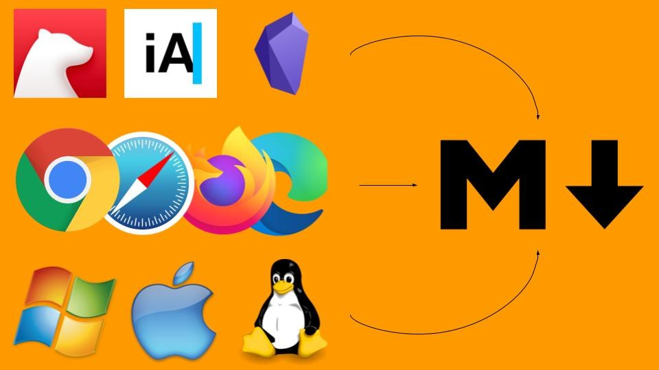

# Документирование для всех

[≡ к началу тематического раздела](index.md) • [☖ мои сайты](../index.md)

## Общие сведения

Документирование — это процесс ведения электронных записей всех внешних и внутренних процедур, деталей и информации, связанных с работой, с тем, чтобы кто-либо мог в любое время ознакомиться с ними и сослаться на них. Внедряя надежную культуру ИТ-документации на рабочем месте, компании могут оптимизировать свои операции, выполнять больше задач за меньшее время и снижать стресс на рабочем месте, вызванный большими рабочими нагрузками. Это сокращает время, затрачиваемое профессионалами на изучение нового процесса, и позволяет им быстрее приступить к работе.

Такое документирование не обязательно должно быть связано с работой, а также даже не обязательно делиться контентом с другими, а можно свои заметки оформлять простейшим способом в самых простейших текстовых редакторах. При этом отображаться они будут в симпатичном виде и удобны в использовании, близко к тому как в вебе, с возможностью переходов между заметками и вставкой изображений и другого медиа-контента даже с внешних ресурсов. При необходимости распространении контента на различных сайтах в большинстве случаев не потребуется значительное его редактирование.

Если контент опубликован в вебе для публичного просмотра или для ограниченной аудитории, то к нему легко может получить доступ вне зависимости от места расположения пользователей и с различных устройств. Та же технология може работать только в пределах сети фирмы или домашней сети.

- [Важность документирования | atlassian.com](https://www.atlassian.com/ru/work-management/knowledge-sharing/documentation/importance-of-documentation)
- [Smart Documentation: Benefits and Best Practices | itglue.com](https://www.itglue.com/blog/benefits-and-best-practices-of-smart-documentation/)

Самый базовый строительный блок веба [HTML](https://developer.mozilla.org/ru/docs/Web/HTML) (HyperText Markup Language — «язык гипертекстовой разметки»), но скорее всего он не для широкого круга создателей контента.

В настоящее время одним из самых популярных форматов для документирования является Markdown, благодаря максимально простому синтаксису и возможности создания текста даже в наипростейших текстовых редакторах. При этом распространено большое количество просмотрщиков, которые позволяют  эту документацию представить красиво и удобной для работы, преобразуя ее "на лету" в HTML.

Есть и генераторы статических сайтов, которые пребразуют документацию на Markdown в готовый сайт, который можно затем опубликовать.

> **[Рекомендуемая структура вашего контента](recommended-doc-site-structure.md)**

 _Возьмите любой Markdown-редактор, браузер или операционную систему — разметка Markdown будет везде одинаково отображаться и форматироваться_

> Вы можете оценить Markdown, зная, что данный текст оформлен в этом формате

<details>
<summary><i>Пример текста в формате Markdown</i> ⇅</summary>

```md
 Самый базовый строительный блок веба [HTML](https://developer.mozilla.org/ru/docs/Web/HTML) (HyperText Markup Language — «язык гипертекстовой разметки»), но скорее всего он не для широкого круга создателей контента.

В настоящее время одним из самых популярных форматов для документирования является Markdown, благодаря максимально простому синтаксису и возможности создания текста даже в наипростейших текстовых редакторах. При этом распространено большое количество просмотрщиков, которые позволяют  эту документацию представить красиво и удобной для работы, преобразуя ее "на лету" в HTML.

Есть и генераторы статических сайтов, которые пребразуют документацию на Markdown в готовый сайт, который можно затем опубликовать.

 _Возьмите любой Markdown-редактор, браузер или операционную систему — разметка Markdown будет везде одинаково отображаться и форматироваться_

> Вы можете оценить Markdown, зная, что данный текст оформлен в этом формате
```

</details>

> Знание и умение использовать Markdown ценяться для широчайшего круга специалистов, а для многих является насущной потребностью

## О Markdown подробнее

Markdown – это облегченный язык разметки, текст с применением такой разметки может быть преобразован соответствующим инструментом в HTML. Главной особенностью данного языка является максимально простой синтаксис, который служит для упрощения написания и чтения кода разметки, что, в свою очередь, позволяет легко его корректировать. Теперь рассмотрим более подробно функции языка разметки Markdown.

Каждый из документов с расширением `.md` представляет собой обычный текстовый файл в формате **Markdown**, который можно редактировать даже в самом простом текстовом редакторе, например, Блокноте (notepad). Кодировка файла должна быть `UTF-8`.

Красивый просмотр документов в формате Markdown можно и в веб-браузерах, установив для этого соответствующее расширение.
Например, [Markdown Viewer](https://chrome.google.com/webstore/detail/markdown-viewer/ckkdlimhmcjmikdlpkmbgfkaikojcbjk) одно из таких расширений для Chrome и Edge Chromium.

- [Путівник по Markdown](https://markdown.rozh2sch.org.ua/)
- [10+ крутых редакторов с поддержкой Markdown](https://blog.themarfa.name/10-krutykh-riedaktorov-s-poddierzhkoi-markdown/)
- [5 Markdown Viewer for Chrome](https://linuxpip.org/markdown-viewer-chrome/)

<details>
  <summary><i>Еще</i> ⇅</summary>

- [Шпаргалка по синтаксису Markdown](https://ydmitry.ru/blog/rukovodstvo-po-markdown-dlya-uproshcheniya-veb-razrabotki/)
- [Введение в Markdown](https://ru.markdown.net.br/nachinaya/)
- [Введение в Markdown: главное, что вы хотели знать о разметке, но стеснялись спросить | bbbl.dev](https://bbbl.dev/articles/all-about-markdown)
- `►` [Полный курс по Markdown](https://www.youtube.com/watch?v=8owG83ozHYw)
- `►` [Markdown - напиши README за 2 минуты](https://www.youtube.com/watch?v=FFBTGdEMrQ4)
- `►` [Markdown - что за язык и как им пользоваться](https://www.youtube.com/watch?v=jPKi2Addbxw)
- `►` [Markdown и системы документирования](https://www.youtube.com/watch?v=Jv-WUHW5PkY)

- После пустой строки начинается новый абзац. Перенести строку в текущем абзаце можно с помощью пробела и символа `\` в конце строки.
- [Как оформить распахиваемый контент по щелчку мыши](https://gist.github.com/scmx/eca72d44afee0113ceb0349dd54a84a2)
- [Представление структуры каталогов и файлов в синтаксисе Markdown](https://coderoad.ru/19699059/Представление-структуры-каталогов-и-файлов-в-синтаксисе-Markdown)

</details>

## О наборе текста

- [24 правила набора текста](https://idg.net.ua/blog/pravila-nabora-teksta)
- [Типографская раскладка | dou.ua](https://dou.ua/forums/topic/37897/)
- [Как превратить обычную клавиатуру в 60-процентную | dou.ua](https://dou.ua/forums/topic/37776/)
